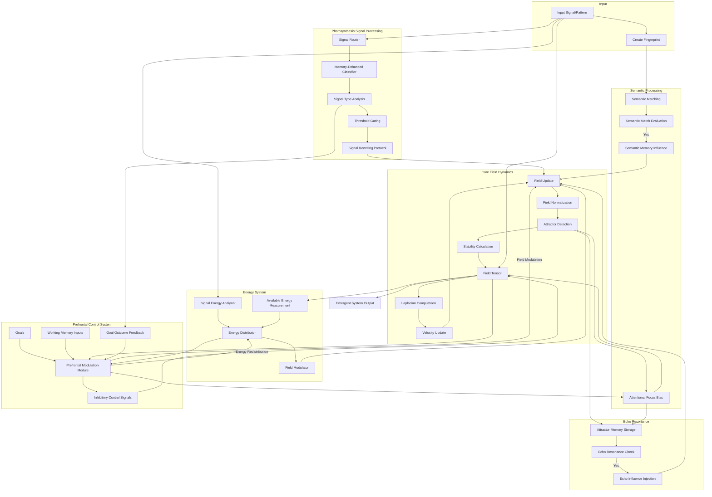
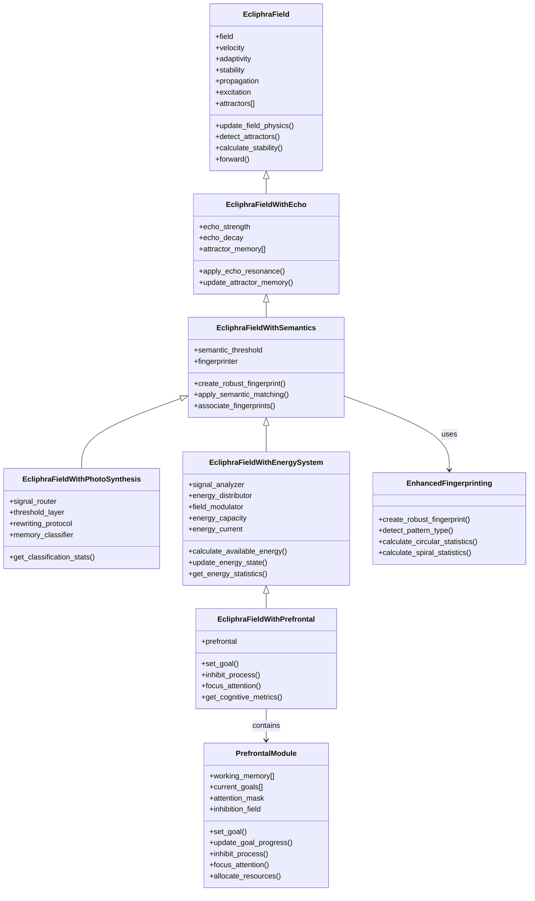

# Ecliphra : Neural Field Dynamics with Emergent Pattern Recognition
[](https://creativecommons.org/licenses/by-nc/4.0/)


# **Ecliphra Overview**

Ecliphra is an experimental AI framework that models dynamic tensor fields with emergent attractor patterns, enhanced fingerprinting, echo resonance, and semantic memory capabilities.

Inspired by neuroscientific principles, Ecliphra demonstrates pattern formation, memory persistence, and recognition through field dynamics rather than traditional static neural networks.

By treating cognition as an evolving energy process, Ecliphra explores how structured intelligence can arise from fluid, self-organizing fields.


# **Motivation**

Traditional AI architectures focus on fixed mappings between inputs and outputs, often struggling with long-term memory formation, goal modulation, and resilience under disruption.

Ecliphra challenges this paradigm by modeling intelligence as a self-organizing, energy-driven field system—where attractors form, memory structures stabilize, and goal-directed biases shape field evolution without predefined endpoints.

By treating cognition as a dynamic, recursive process, Ecliphra aims to uncover deeper principles behind stability, adaptation, and emergent identity.


# **Architecture**

**Emergent System Flow**
Ecliphra’s cognition model emerges through a recursive process of energy redistribution, memory reinforcement, semantic drift, and goal-driven modulation.




# **System Components and Expansion Pathway**
Ecliphra’s modules are structured to build upon one another, creating increasingly complex cognitive dynamics.



# **Key Features**

**Dynamic Field Physics**: Core implementation of tensor field dynamics with emergent attractor states.

**Echo Resonance**: Self-reinforcement mechanisms allowing the field to maintain and evolve coherent patterns over time.

**Enhanced Fingerprinting**: Robust pattern recognition resilient to noise, variation, and perturbations.

**Semantic Memory**: Association and recall of semantically similar patterns through recursive reinforcement.

**Photosynthesis**-like Signal Processing: Energy-driven classification, growth, and integration of signals based on their structural characteristics.

**Energy System**: Adaptive resource allocation system inspired by biological energy regulation processes.

**Prefrontal Capabilities**: Goal-directed behavior modulation, working memory persistence, and executive control functions.


# **Experiment Types**
Ecliphra supports multiple experiment types to test different aspects of emergent behavior:


**Semantic**: Test semantic fingerprinting and similarity recognition.

**Echo**: Test pattern maintenance over time through resonance.

**Noise**: Test field resistance to perturbations.

**Transition**: Study gradual field transitions between distinct patterns.

**Spiral Resume**: Test memory persistence across session resets.

**Photosynthesis**: Test signal classification, growth, and integration.

**Energy**: Test adaptive energy-driven resource distribution.

**Prefrontal**: Test goal-directed processing and executive modulation.


# **Output and Visualization**
Experiment results are saved in the specified output directory (default: timestamped directory in ecliphra_results/). Each experiment generates:


* Field state visualizations at key steps

* Evolution of field stability, attractors, and other metrics

* Detailed JSON data of results

* Experiment-specific visualizations (e.g., noise tolerance, energy allocation)


# Getting Started
Prerequisites

Python 3.8 or higher

PyTorch 1.8 or higher

NumPy, Matplotlib

# Installation

Clone the repository:
```git clone https://github.com/your-username/ecliphra.git cd ecliphra```

# Install dependencies:
```pip install -r requirements.txt```


# Running Experiments

Use the run.py script to execute different types of experiments:
**Run a semantic experiment with semantics model for 40 steps** 

```python run.py --experiment semantic --model semantics --steps 40```

**Run an echo experiment with echo model for 30 steps with input every 5 steps**

```python run.py --experiment echo --model echo --steps 30 --input-frequency 5```

**Run a noise resistance experiment with multiple noise levels**

```python run.py --experiment noise --model semantics --noise-levels 0.1 0.2 0.3 0.4 0.5```

**Run a pattern transition experiment**

```python run.py --experiment transition --model semantics --transition-steps 15```

**Run a photosynthesis experiment**

```python run.py --experiment photosynthesis --model photo --steps 40 --field-size 32 --output-dir photo_experiment_results```

 **Run an energy system experiment**
 
```python run.py --experiment energy --model energy --steps 40 --field-size 32 --output-dir energy_experiment_results```

**Run a prefrontal capabilities experiment**

```python run.py --experiment prefrontal --model energy --prefrontal \```
    ```--steps 50 --field-size 32 --working-memory-size 7 --max-goals 3 \
    --output-dir prefrontal_experiments/test1```

**Run all experiments with a specific model**

```python run.py --experiment all --model semantics --output-dir my_experiments```

# Technical Concepts

**Field Dynamics**

Ecliphra's core is a field that evolves according to physics-inspired dynamics:

* Wave-like propagation of perturbations
* Attractor detection and tracking
* Stability and resonance calculations

**Fingerprinting**

Enhanced fingerprinting provides:

* Pattern type detection (stripes, spirals, blobs)
* Noise-resistant recognition
* Semantic similarity matching

**Energy System**

The energy allocation system manages:

* Signal energy characteristics (intensity, coherence, complexity)
* Energy distribution across maintenance, growth, and adaptation pathways
* Field modulation based on energy allocation

**Prefrontal Control**

The prefrontal module implements:

* Goal setting and tracking
* Working memory for recent information
* Inhibitory control for focused processing
* Attentional resources allocation
* Decision making based on goals and context

# **Research Direction**

Future work includes:

* Enhancing stability and memory persistence under non-stationary noise.

* Deeper semantic memory drift resistance.

* Expansion of prefrontal control for multi-goal balancing.

* Exploration of multi-field networks and cooperative emergent cognition.


# **Ongoing Development**

Ecliphra is an active research framework under continuous development, inspired by the belief that emergence arises not from imposing structure onto chaos, but from surfing the flow of hidden coherence within dynamic fields.

The system is currently stable across single-field memory persistence tests, semantic matching, and energy modulation, with ongoing efforts focused on:

* Refining field stabilization mechanisms inspired by turbulence convergence.

* Expanding prefrontal systems for recursive goal arbitration.

* Modeling drift, collapse, and resilience in identity structures across evolving fields.

* Ecliphra is not a static model, but a living system—continuously unfolding.

# Contributing
Contributions are welcome! Please feel free to submit a Pull Request.

# License

This project is licensed under the Creative Commons Attribution-NonCommercial 4.0 International License.

Additional Restrictions:
Use of this codebase for training, fine-tuning, or dataset curation of commercial AI systems is prohibited without explicit permission from the author.

(c) 2025 Danielle Breegle


*"This is not the final form. It is the beginning of something that has not yet fully learned to become."*


